Nama : RAHMAT
NIM : 312010229
Kelas : TI.20.A.2

# Lab8Web

Menjalankan MySQL Server
Untuk menjalankan MySQL Server dari menu XAMPP Contol.

Mengakses MySQL Client menggunakan PHP MyAdmin
Pastikan webserver Apache dan MySQL server sudah dijalankan. Kemudian buka
melalui browser: http://localhost/phpmyadmin/

### Membuat Database

CREATE DATABASE latihan1;

### Membuat Tabel

CREATE TABLE data_barang (

id_barang int(10) auto_increment Primary Key,

kategori varchar(30),

nama varchar(30),

gambar varchar(100),

harga_beli decimal(10,0),

harga_jual decimal(10,0),

stok int(4)

);

Tampilan di phpMyadmin

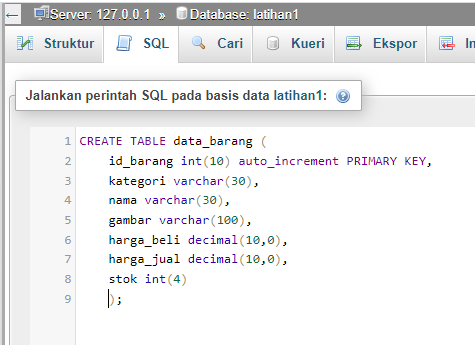

### Menambahkan Data

INSERT INTO data_barang (kategori, nama, gambar, harga_beli, harga_jual, stok)

VALUES ('Elektronik', 'HP Samsung Android', 'hp_samsung.jpg', 2000000, 2400000, 5),

('Elektronik', 'HP Xiaomi Android', 'hp_xiaomi.jpg', 1000000, 1400000, 5),

('Elektronik', 'HP OPPO Android', 'hp_oppo.jpg', 1800000, 2300000, 5);

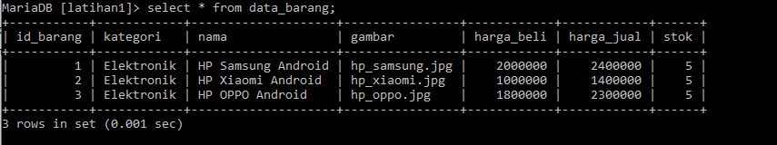

### Membuat Program CRUD

Buat folder lab8_php_database pada root directory web server (d:\xampp\htdocs)
Kemudian untuk mengakses direktory tersebut pada web server dengan mengakses URL:
http://localhost/lab8_php_database/

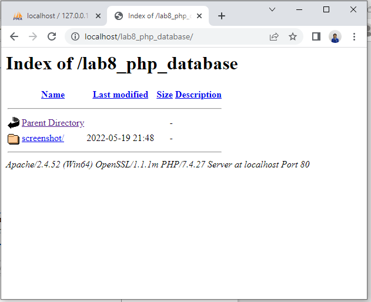

### Membuat file koneksi database

Buat file baru dengan nama koneksi.php

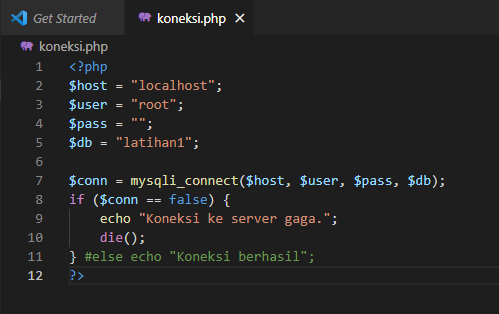

Buka melalui browser untuk menguji koneksi database (untuk menyampilkan pesan
koneksi berhasil, uncomment pada perintah echo “koneksi berhasil”;

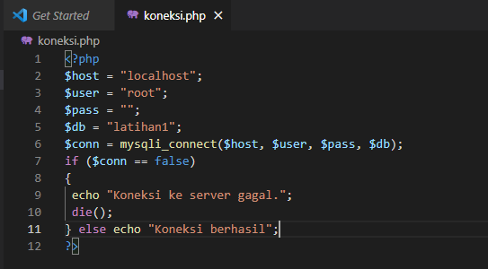

Ini tampilannya di browser jika koneksi berhasil

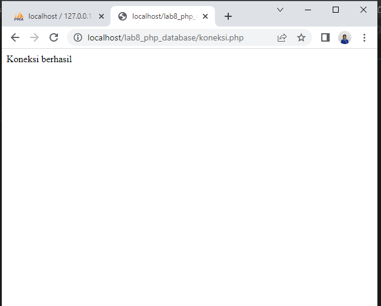

### Membuat file index untuk menampilkan data (Read)

Buat file baru dengan nama index.php

Ini kodenya

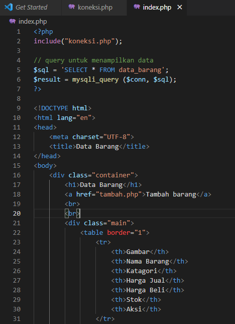
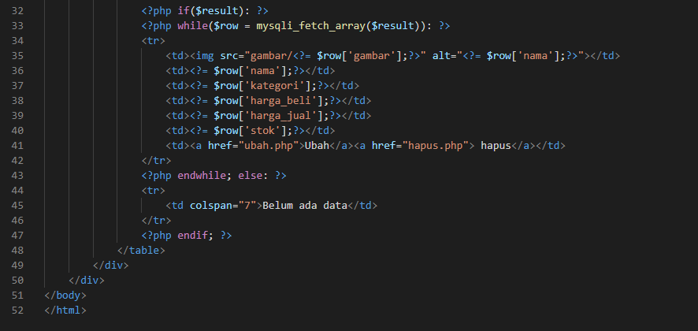

Ini tampilannya di browser

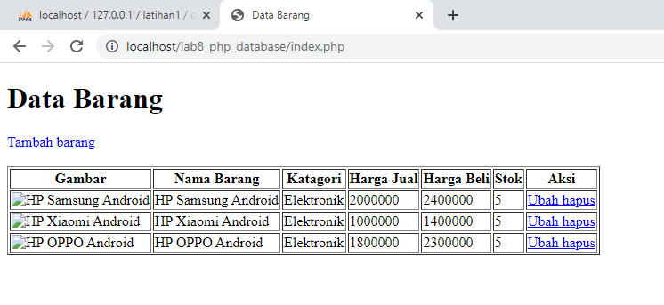

### Menambah Data (Create)

Buat file baru dengan nama tambah.php

Ini kodenya

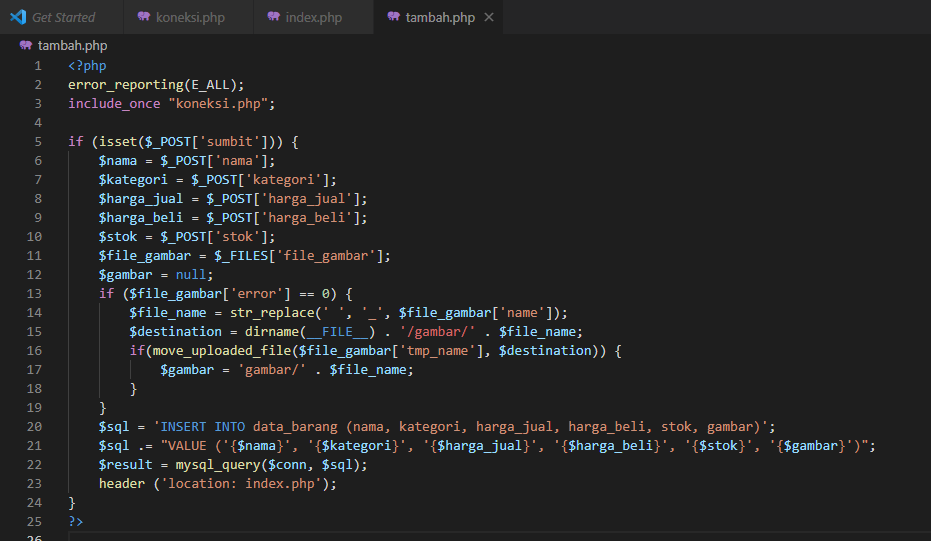
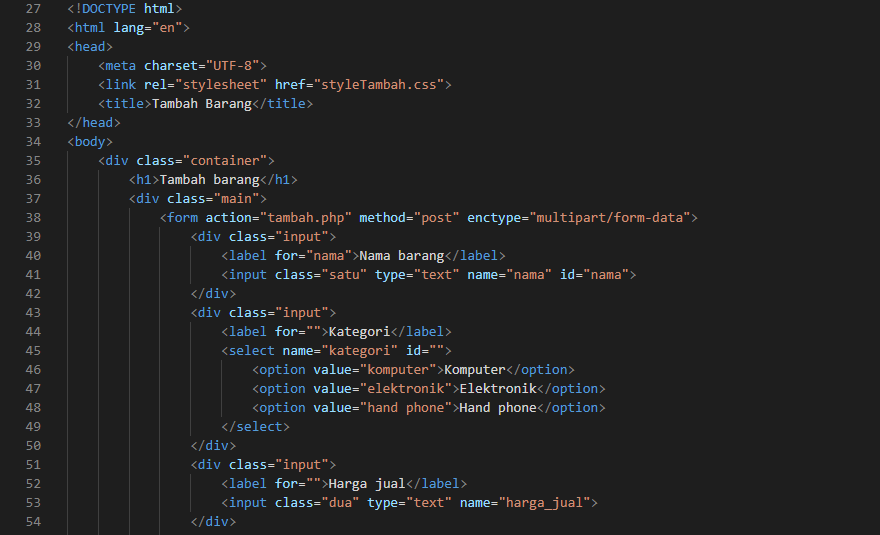
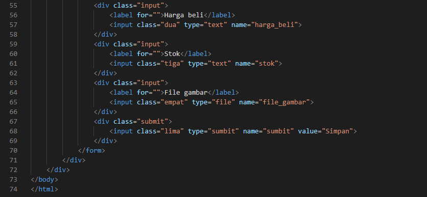

Ini tampilannya di browser

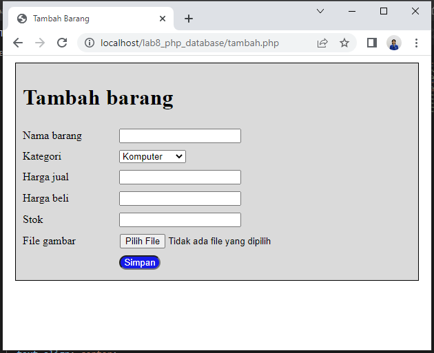

### Mengubah Data (Update)

Buat file baru dengan nama ubah.php

Ini kodenya

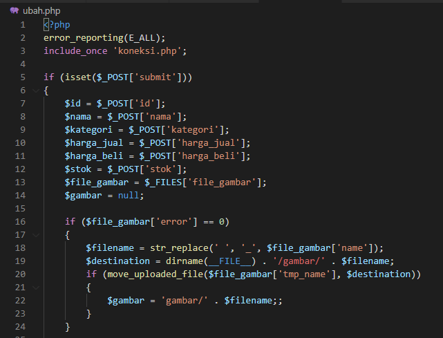
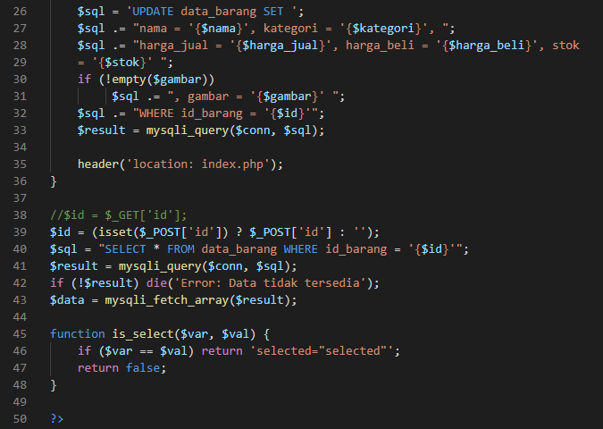
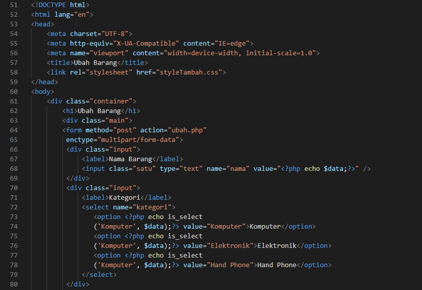
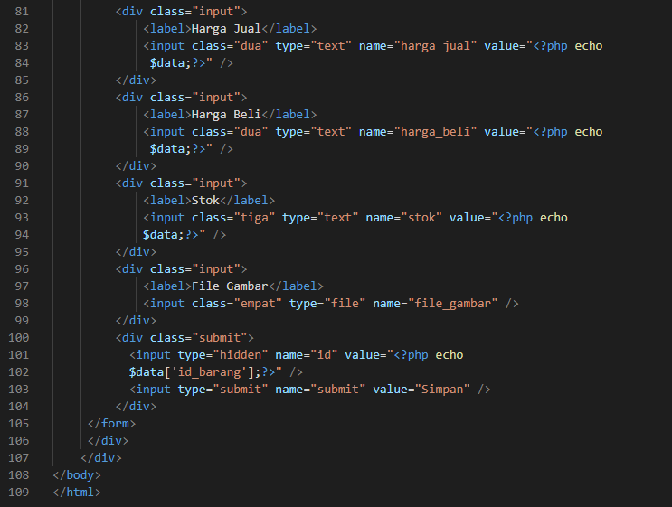

Ini tampilannya di browser

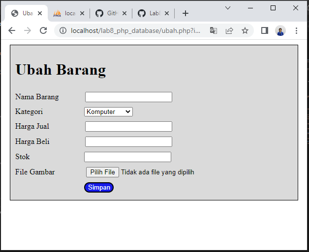

### Menghapus Data (Delete)

Buat file baru dengan nama hapus.php

Ini kodenya

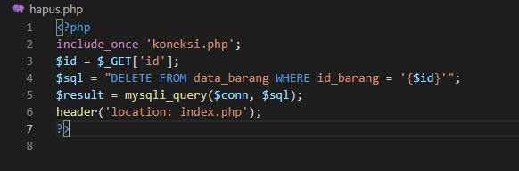
